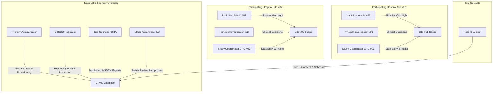

# 🏛️ All India Institute of Ayurveda (AIIA) — Clinical Trials Management System (CTMS)

> **Enterprise Multi-Centric Clinical Trials Management System, Regulatory Oversight & CDISC SDTM / HL7 FHIR Interoperability Platform**  
> Built for the **Ministry of Ayush, Government of India** | Smart India Hackathon Problem Statement **SIH26046**

---

## 📋 Executive Overview

The **AIIA Clinical Trials Management System (CTMS)** is a comprehensive, production-grade clinical trial platform engineered for multi-centric traditional medicine (Ayurveda) and integrative clinical research. Built in strict alignment with **ICH GCP E6(R2)**, the **Indian New Drugs and Clinical Trials Rules 2019 (NDCT Rules)**, the **Digital Personal Data Protection (DPDP) Act 2023**, and **21 CFR Part 11 electronic records standards**, the platform coordinates the complete clinical trial lifecycle across hospitals, regulatory bodies, ethics committees, and trial subjects.

### Key Highlights
* **🏛️ True Government Portal Aesthetic**: Clean, rectangular, high-legibility UI designed to National Informatics Centre (NIC) and Ministry of Ayush standards.
* **🛡️ 8-Role Statutory RBAC**: Server-enforced authorization with site-scoped data isolation and DPDP Act 2023 PII de-identification.
* **📜 Master Protocol & Site Provisioning**: Administrative engine to define clinical protocols, onboard hospital sites, and assign Principal Investigators.
* **👥 Account Provisioning & Authentication**: Primary Administrator user creation with Argon2id/BCrypt password hashing and immutable audit logging.
* **📋 End-to-End Clinical Lifecycle**: Screening $\rightarrow$ ABHA-linked E-Consent $\rightarrow$ Randomization $\rightarrow$ Scheduled Protocol Visits (1–6) $\rightarrow$ MedDRA Adverse Events $\rightarrow$ Protocol Deviations.
* **📊 Quantitative Safety Signal Detection**: Proportional Reporting Ratio (PRR) and Pearson $\chi^2$ pharmacovigilance analytics with de-identified SAE PDF report generation.
* **🌐 Universal Data Interoperability**: Instant 1-click export to **CDISC SDTM Dataset-JSON v1.1** (DM, AE, SV, DV, TS domains in a standardized `.zip` bundle) and **HL7 FHIR R4 Bundle** format.
* **🧹 Production Clean Slate Reset**: Administrative capability to purge synthetic test data and start 100% real clinical intake with a single click.

---

## 🏗️ System Architecture & Tech Stack

```text
                                      +------------------------------------+
                                      |     Web Browser / Mobile Client    |
                                      |      React 18 + Vite + Tailwind    |
                                      +-----------------+------------------+
                                                        |
                                          HTTP / REST   |   WebSocket (/ws)
                                                        v
+----------------------------------------------------------------------------------------------------+
|                                    FastAPI Application Gateway (:8000)                             |
|  +-------------------+  +--------------------+  +----------------------+  +---------------------+  |
|  |  Auth & RBAC      |  |  Clinical Gateway  |  |  Safety / Signal     |  |  CDISC / FHIR R4    |  |
|  |  (Argon2 / JWT)   |  |  (Visits, Consent) |  |  (PRR, Chi-Sq, PDF)  |  |  (SDTM-JSON, Bundles)| |
|  +-------------------+  +--------------------+  +----------------------+  +---------------------+  |
+-----------------------------------+----------------------------------+-----------------------------+
                                    |                                  |
                                    v                                  v
                    +-------------------------------+  +-------------------------------+
                    |     PostgreSQL 16 Engine      |  |     Redis 7 Pub/Sub Line      |
                    |   (SQLModel + Alembic DB)     |  |   (Live Dashboard Broadcast)  |
                    +-------------------------------+  +-------------------------------+
```

| Layer | Technologies & Libraries | Standard / Purpose |
| :--- | :--- | :--- |
| **Frontend UI** | React 18, Vite 6, Tailwind CSS, Lucide Icons, Recharts | Government Portal Design, Responsive Dashboard |
| **Backend API** | Python 3.12, FastAPI 0.115.6, Uvicorn, Pydantic v2 | High-performance Async REST Gateway |
| **Data Layer** | PostgreSQL 16, SQLModel 0.0.22, SQLAlchemy 2.0, Alembic | Relational Clinical Schemas & Migrations |
| **Live Sync** | Redis 7, `redis-py` 5.2.1, Native WebSockets | Real-time multi-client live dashboard updates |
| **Document Engine** | ReportLab 4.2.5, `pypdf` 5.1.0 | 21 CFR Part 11 Safety Case PDF Generation |
| **Security** | PyJWT 2.10.1, BCrypt 5.0.0, Argon2id | Role-Based Access Control & Password Hashing |
| **Interoperability** | CDISC SDTM IG 3.3, Dataset-JSON v1.1, HL7 FHIR R4 | Global Data Standards for Clinical Submissions |
| **Deployment** | Docker Compose, Multi-stage Dockerfiles | Containerized local and cloud deployment |

---

## 👥 8-Role Access Control (RBAC) & Statutory Jurisdiction

The platform strictly enforces role boundaries at the API level (`backend/app/rbac.py`). Direct cross-site requests or unauthorized privilege escalations fail-closed with `403 Forbidden`.



| Role | Role Key | Scope | Permissions & Statutory Boundary |
| :--- | :--- | :--- | :--- |
| **Primary Administrator** | `admin` | Global (All Sites) | System-wide configuration, Trial Protocol definition, Hospital Site registration, User Account provisioning, and Production Clean Slate resets. |
| **Institution Site Admin** | `institution_admin` | Own Hospital Site | Site-scoped hospital staff oversight, local recruitment quota monitoring, and patient inquiry resolution. Cannot modify clinical write records. |
| **Principal Investigator** | `principal_investigator` | Own Hospital Site | Lead clinician at hospital. Full clinical write access, participant intake, consent verification, safety event reporting, and deviation management. |
| **Clinical Coordinator** | `coordinator` | Own Hospital Site | Day-to-day study coordinator. Schedules visits, records vitals/CRF values, intake screening, and logs protocol deviations. |
| **Institutional Ethics Committee** | `ethics_committee` | Global / Multi-site | Independent safety reviewer. Reviews serious adverse events (SAEs), protocol deviations, and issues statutory ethics approval numbers. PII masked. |
| **Trial Sponsor / CRA** | `sponsor` | Global / Multi-site | Multi-center trial monitoring, recruitment velocity tracking, SDTM/FHIR data exports, and milestone tracking. No direct site clinical write. |
| **CDSCO Regulatory Inspector** | `regulator` | Global (All Sites) | National statutory inspector. Unrestricted read-only access to all trial sites, 21 CFR Part 11 audit trails, safety signal metrics, and regulatory exports. |
| **Trial Subject / Patient** | `patient` | Own Record Only | Dedicated patient portal. Access to personal visit schedule, digital E-Consent signing with ABHA ID, and direct messaging with Institution Admin. |

---

## 🔄 Core Clinical Workflows & Modules

### 1. Primary Administrator Control Plane & Clean Slate Engine
* **Protocol Creator (`POST /api/trials`)**: Define protocol code, scientific title, phase (I–IV), dual biomedical & Ayurvedic indications, formulation, control arms, and target sample sizes.
* **Site Onboarding (`POST /api/sites`)**: Register participating medical colleges and research hospitals, assign 2-digit site codes, and appoint Principal Investigators.
* **User Account Provisioning (`POST /api/users`)**: Provision user credentials with role assignment, hospital site linkage, and Argon2 password hashing.
* **Clean Slate Data Reset (`POST /api/admin/reset-trial-data`)**: Securely wipes synthetic demo patients and simulated visits to start 100% real clinical trial intake while preserving core study setups, user accounts, and immutable audit logs.

### 2. Participant Recruitment & Digital E-Consent
* **Ethics-Permitted Screening Intake**: Captures Subject Demographics (Age, Sex), Biomedical History, Ayurvedic Prakriti / Dosha assessment, and Ethics-Permitted Contact Info (Full Name, Phone +91, Email) under DPDP Act 2023 Sec 6.
* **ABHA Digital E-Consent (`POST /api/econsent/sign`)**: Digital consent capture supporting Ayushman Bharat Health Account (ABHA) IDs, SHA-256 cryptographic signature digests, and downloadable legal consent certificates.

### 3. Protocol Visit Tracking & Adverse Event Safety
* **Scheduled Protocol Visits (Visits 1–6)**: Tracks baseline, interim check-ins, medication compliance, vital signs (BP, Pulse, Weight), and laboratory outcome measures. Out-of-window visits automatically trigger protocol deviation workflows.
* **MedDRA Adverse Event Reporting**: Structured safety intake capturing onset dates, severity grading, causality assessment (*Definite, Probable, Possible, Unlikely*), action taken, and outcome.
* **Safety Signal Detection (PRR & $\chi^2$)**: Real-time statistical pharmacovigilance calculating Proportional Reporting Ratios and Pearson Chi-Square values across verbatim terms.
* **De-Identified SAE Case PDF**: One-click generation of 21 CFR Part 11 compliant de-identified safety reports for regulatory submissions.

### 4. Universal Interoperability (CDISC SDTM & HL7 FHIR R4)
* **CDISC SDTM IG 3.3 Dataset-JSON v1.1**: One-click export bundling **DM** (Demographics), **AE** (Adverse Events), **SV** (Subject Visits), **DV** (Protocol Deviations), and **TS** (Trial Summary) domains into an industry-standard `.zip` submission package.
* **HL7 FHIR R4 Clinical Bundles**: Real-time export of patients, research studies, observations, and consents formatted as standardized FHIR JSON resources.

---

## 💻 Portal Interface & Navigation Design

The frontend is styled according to the **Government of India National Informatics Centre (NIC)** design system:
* **Two-Tier Balanced Navbar**:
  * **Top Bar**: Government of India / Ministry of Ayush branding, verified user credentials, jurisdiction scope, and live Redis status indicator.
  * **Main Navigation Bar**: Crisp rectangular tabs spanning `[ Dashboard ]`, `[ Clinical Infrastructure & Actions ]`, `[ + Create New Account ]`, `[ Access Rules & Matrix ]`, and `[ Sign Out ]`.
* **Dedicated Full-Page Workflows**:
  * **User Account Provisioning (`/create-account`)**: Structured 3-section government registration form with statutory role definitions and site jurisdiction allocation.
  * **Clinical Infrastructure (`/infrastructure`)**: Dedicated registries for participating hospital sites, trial protocols, and clean-slate resets.

---

## 🚀 Quick Start & Installation

### Prerequisites
* **Docker Desktop** (v24.0+) with WSL2 backend (on Windows) or native Docker on Linux/macOS.
* **Docker Compose** (v2.20+).
* Web browser (Chrome, Edge, Firefox, Safari).

### 1. Clone the Repository
```bash
git clone https://github.com/Arham-imam-19/AIIA_build.git
cd AIIA_build
git checkout FHIR-CDISC
```

### 2. Start the CTMS Platform with Docker Compose
```bash
docker compose up -d --build
```

### 3. Verify Running Services
```bash
docker compose ps
```
You should see all 4 core services running and healthy:
* `aiia_frontend`: React 18 + Vite development server running on `http://localhost:5173`
* `aiia_backend`: FastAPI Python server running on `http://localhost:8000`
* `aiia_db`: PostgreSQL 16 Database on `localhost:5432`
* `aiia_redis`: Redis 7 Pub/Sub Engine on `localhost:6379`

### 4. Access the Application
* **Staff & Admin Portal**: [http://localhost:5173](http://localhost:5173)
* **Patient Portal**: [http://localhost:5173/patient-login](http://localhost:5173/patient-login)
* **Interactive OpenAPI Docs (Swagger)**: [http://localhost:8000/docs](http://localhost:8000/docs)
* **System Health Check**: [http://localhost:8000/api/health](http://localhost:8000/api/health)

---

## 🔑 Default Demonstration Personas

In development mode, you can sign in using pre-configured accounts or provision new ones through the Primary Administrator interface:

| Persona | Role | Email | Password |
| :--- | :--- | :--- | :--- |
| **Primary Administrator** | System Admin | `admin@demo.aiia-ctms.in` | `aiia2026` |
| **Dr. Rajesh Sharma** | Principal Investigator (Site 01) | `pi.delhi@demo.aiia-ctms.in` | `aiia2026` |
| **Priya Nair** | Research Coordinator (Site 01) | `crc.delhi@demo.aiia-ctms.in` | `aiia2026` |
| **Hospital Administrator** | Institution Admin (Site 01) | `instadmin.delhi@demo.aiia-ctms.in` | `aiia2026` |
| **Prof. Anand Verma** | Ethics Committee (IEC) | `ethics@demo.aiia-ctms.in` | `aiia2026` |
| **Vikram Malhotra** | Sponsor / CRA Monitor | `sponsor@demo.aiia-ctms.in` | `aiia2026` |
| **Sunita Rao** | CDSCO Regulatory Inspector | `regulator@demo.aiia-ctms.in` | `aiia2026` |
| **Trial Participant** | Patient Subject | `patient1@demo.aiia-ctms.in` | `aiia2026` |

---

## 🧪 Testing & Quality Assurance

The system maintains a comprehensive automated test suite covering authentication, RBAC boundaries, trial state transitions, e-consent cryptographic hashing, safety signal math, CDISC SDTM serialization, and user provisioning:

### Running Backend Pytest Suite
```bash
docker compose exec backend pytest
```
* **Status**: **975 passed (0 failures)** in 28.34s across all unit, integration, and security tests.

### Running Frontend Production Build
```bash
docker compose exec frontend npm run build
```
* **Status**: **Built in 3.60s with 0 errors** via Vite.

---

## 📜 Regulatory & Compliance Disclosures

* **21 CFR Part 11**: All database modifications write transactional, append-only audit log records attributing changes to the authenticated user ID, client IP address, old/new field values, and UTC timestamps.
* **DPDP Act 2023**: Direct patient personal identifiable information (PII) is masked and restricted to authorized site clinicians. Sponsor, Ethics, and Regulatory views strictly enforce de-identification.
* **CDISC & FHIR Standards**: Export formats conform to CDISC SDTM IG 3.3 Dataset-JSON specification and HL7 FHIR Release 4 standard.

---

## 👥 Authors & Acknowledgments

* **Smart India Hackathon 2024 / 2026 Team**
* Developed for the **All India Institute of Ayurveda (AIIA)** and the **Ministry of Ayush, Government of India**.
