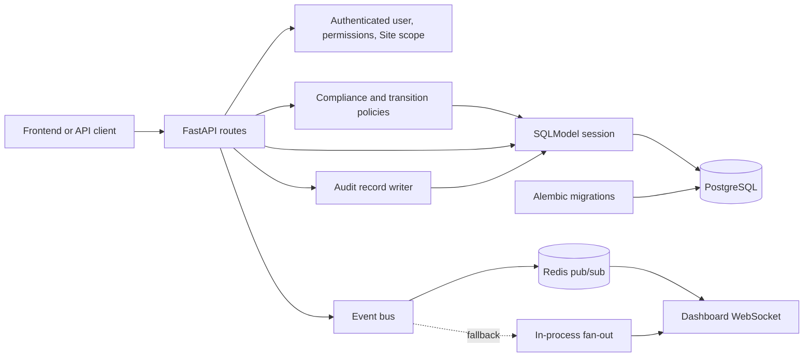
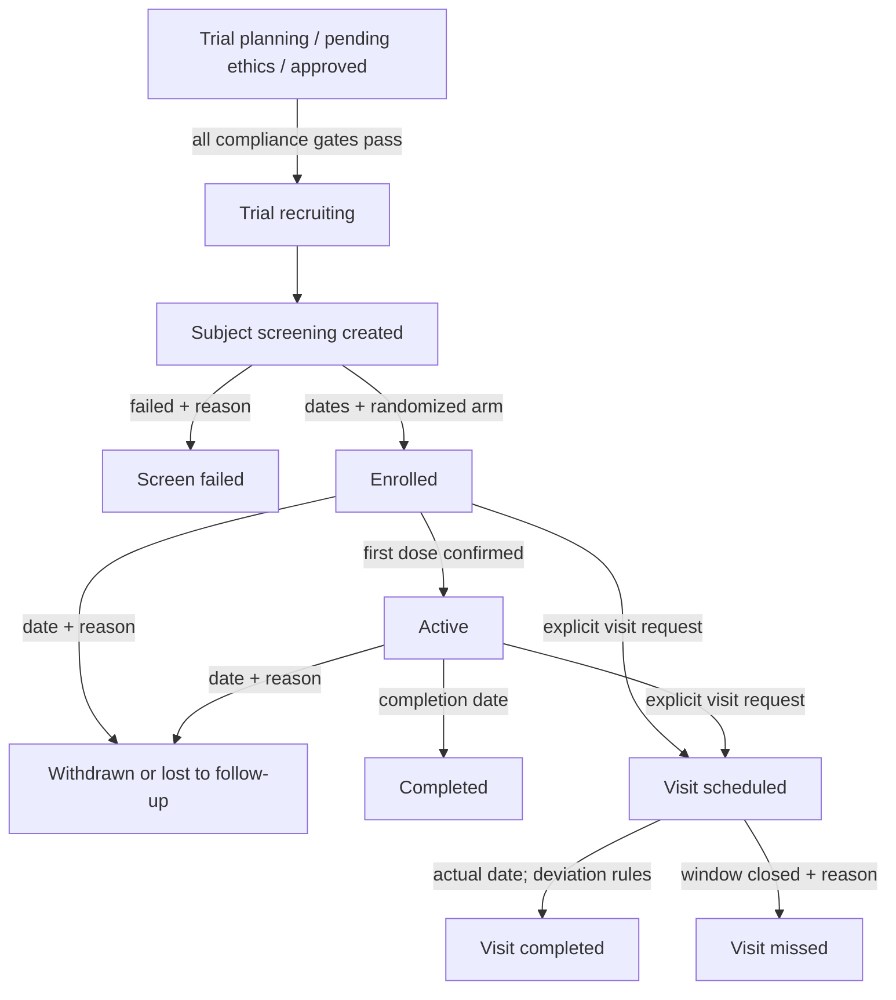

# Backend

## Backend Overview

This directory contains the FastAPI backend for the Clinical Trial Management System (CTMS). It exposes trial, site, subject, visit, adverse-event, audit, dashboard, authentication, authorization, simulation, and live-update interfaces backed by a relational database.

The backend is responsible for:

- persisting the seven core entities and exposing their supported read APIs;
- enforcing role permissions and Site visibility;
- applying Trial, Subject, and Visit workflow rules;
- committing supported clinical mutations together with their audit records;
- computing dashboard and recruitment statistics; and
- publishing dashboard refresh events for the existing simulation workflows.

It is not a general electronic data-capture platform, protocol designer, identity provider, pharmacovigilance coding engine, CDISC/FHIR implementation, or proof of regulatory compliance. The repository contains placeholders and product metadata for some future capabilities, but they are not implemented by the backend described here. The React frontend and its user-interface behavior are outside this directory.

## Technology Stack

| Area | Repository-confirmed technology |
| --- | --- |
| API | Python, FastAPI 0.115.6, Uvicorn 0.34.0 |
| Validation and ORM | Pydantic through FastAPI, SQLModel 0.0.22, SQLAlchemy |
| Database | PostgreSQL 16 in Docker Compose; SQLite is used by tests and is supported as a direct-run smoke-test fallback |
| Migrations | Alembic 1.14.0 |
| PostgreSQL driver | psycopg 3.2.3 |
| Authentication support | PyJWT 2.10.1, bcrypt 5.0.0, FastAPI HTTP bearer authentication |
| Live updates and token revocation | Redis 7 in Compose, redis-py 5.2.1, with an in-process live-event fallback |
| Tests | pytest 8.3.4, HTTPX 0.28.1, FastAPI/Starlette `TestClient` |
| Containers | Docker, Docker Compose |

Pinned Python dependencies are in [requirements.txt](requirements.txt). The Compose stack is defined in [../docker-compose.yml](../docker-compose.yml).

## Architecture



- **API layer:** [app/main.py](app/main.py) creates the application and registers the routers in [app/routers/](app/routers/). Generated OpenAPI schemas are available from the running application.
- **Service layer:** [app/services/](app/services/) contains pure Trial compliance, Subject transition, and Visit transition policies. Mutation routes validate ownership and linkage, invoke these policies, and persist normalized results.
- **Persistence layer:** [app/db.py](app/db.py) provides a lazy shared engine and one SQLModel `Session` per request. Models live in [app/models/](app/models/).
- **Authorization layer:** [app/rbac.py](app/rbac.py) resolves the current user, checks permissions, and applies server-side Site scope.
- **Audit layer:** [app/audit.py](app/audit.py) adds append-only `AuditLog` rows to the same session used for clinical changes.
- **Event layer:** [app/events.py](app/events.py) uses Redis pub/sub when available and an in-process fan-out otherwise. Current production Subject/Visit mutation routes do not publish live events.
- **Migration layer:** [alembic/](alembic/) is the schema source for deployed databases. Application startup does not call `create_all()`.

## Project Structure

```text
backend/
├── alembic/versions/       # ordered schema migrations
├── app/
│   ├── main.py             # application, middleware, router registration, health/meta routes
│   ├── config.py           # environment-backed settings
│   ├── db.py               # engine, sessions, database/schema health checks
│   ├── enums.py            # controlled application vocabularies
│   ├── rbac.py             # authenticated-user interface, permissions, Site scope
│   ├── audit.py            # append-only audit writer
│   ├── events.py           # Redis/in-process event bus
│   ├── synthetic.py        # deterministic demo dataset generator
│   ├── models/             # SQLModel table definitions
│   ├── routers/            # HTTP and WebSocket endpoints by domain
│   └── services/           # workflow and compliance policies
├── tests/                  # unit, API, migration, live, synthetic, and E2E tests
├── alembic.ini             # Alembic configuration
├── entrypoint.sh           # database wait, migrate, start Uvicorn
├── Dockerfile
├── pytest.ini
└── requirements.txt
```

Add routes to the relevant router, persistence fields to a model plus a new migration, and lifecycle rules to the relevant service rather than embedding alternate transition logic in a new endpoint.

## Core Domain Model

The migration chain creates seven tables: `trials`, `sites`, `users`, `subjects`, `visits`, `adverse_events`, and `audit_logs`.

- A **Trial** is the top-level protocol record. A Trial has many Sites and Subjects. Visits and adverse events also carry `trial_id` for direct trial filtering. `activated_by_user_id` identifies the User who activated it.
- A **Site** belongs to exactly one Trial. This project represents an institution participating in multiple trials as separate Site rows rather than a many-to-many institution model.
- A **Subject** belongs to one Trial and one Site. Subjects are de-identified: the model stores a generated subject code and coarse demographics, not a name, address, phone number, or full date of birth.
- A **Visit** belongs to one Subject and one Trial. `performed_by_user_id` may identify the User who recorded a completed Visit.
- A **User** may belong to one Site. Principal Investigators and Coordinators are Site-scoped; trial-wide roles have a null `site_id`.
- An **AuditLog** may reference a User and Trial and identifies the affected entity using `entity_type`, optional `entity_id`, and `entity_label`. User email and role are copied into the entry so attribution does not rely only on the current User row.
- An **AdverseEvent** belongs to a Subject, Trial, and Site and may link to a Visit and reporting or coding-review Users.

Site isolation is enforced in API queries and object lookups, not by a client-supplied filter. Principal Investigators and Coordinators are restricted to their own Site. A list query is narrowed server-side; a direct request for another Site's record is rejected with `403`. A Site-scoped user without an assigned Site fails closed. Trial-wide roles are not Site-scoped, but they still require the relevant domain permission.

## Clinical Workflow



| Workflow | Allowed behavior | Rejected behavior |
| --- | --- | --- |
| Trial compliance and activation | Activation evaluates protocol completeness, date ordering, current ethics approval, CTRI registration, regulatory approval, and an activatable status. Eligible Trials become `recruiting`. | Missing/expired approvals, invalid dates, absent required protocol facts, and non-activatable states return `409`. Inconsistent partial activation state also returns `409`. |
| Screening creation | A Subject may be created only for a `recruiting` Trial and `recruiting` Site belonging to that Trial. The server sets code, `screening` status, `not_randomized` arm, timestamps, and Site scope. | Future/invalid demographics, cross-Trial linkage, inactive lifecycle state, unauthorized Site, and client-supplied extra/server fields are rejected. |
| Screening failure | `screening -> screen_failed` with a nonblank reason. | Enrollment, randomization, exit fields, or a randomized arm on a screen failure are rejected. |
| Enrollment/randomization | `screening -> enrolled` with enrollment date, randomization date, a randomized arm, and optional `prakriti`. Dates must be ordered and not in the future. | Enrollment from another state, `not_randomized`, missing dates, future/out-of-order dates, and retained outcome fields are rejected. |
| First-dose activation | `enrolled -> active` through an empty request body confirming the event. Existing enrollment facts and a randomized arm are required. | There is currently no separate first-dose clinical-date field; extra fields and other source states are rejected. |
| Visit scheduling | One explicitly described Visit may be scheduled for an `enrolled` or `active` Subject. The date must be today or later. | Duplicate `(subject_id, visit_number)`, terminal/ineligible Subject states, past dates, mismatched linkage, extra fields, or an inaccessible Site are rejected. |
| Visit outcome | `scheduled -> completed` requires an actual date. A date more than three days from schedule is normalized to a deviation and needs a description. `scheduled -> missed` is allowed only after the three-day window and requires a description. | Future actual dates, missing/forbidden actual dates, repeated terminal transitions, an open missed window, and missing deviation details are rejected. The Subject must be active to record the outcome. |
| Subject outcome | `active -> completed`; `enrolled` or `active -> withdrawn`/`lost_to_follow_up`. Completion needs a completion date; withdrawal/LTFU needs a date and reason. | Other transitions, future exit dates, dates before enrollment, or incompatible completion/withdrawal fields are rejected. |

Transition conflicts are generally represented as `409`; malformed or semantically invalid request data is represented as `422`.

## API Overview

The tables below summarize registered routes. Except where noted, `/api` routes require `Authorization: Bearer <token>`. The running application's `/docs` and `/openapi.json` are the authoritative references for complete request, response, query, and validation schemas.

### Metadata and authentication

| Method | Path | Purpose | Permission | Important status codes |
| --- | --- | --- | --- | --- |
| GET | `/` | API metadata and links | Public | `200` |
| GET | `/api/health` | Database, schema, and live-bus health | Public | `200` (payload may say `degraded`) |
| GET | `/api/info` | Static project metadata | Public | `200` |
| POST | `/api/auth/login` | Exchange email/password for a bearer token | Public | `200`, `401`, `403` |
| GET | `/api/auth/me` | Return current identity, Site scope, and grants | Authenticated | `200`, `401` |
| POST | `/api/auth/logout` | Audit logout and revoke the current token | Authenticated | `200`, `401` |
| GET | `/api/auth/demo-users` | Development-only synthetic persona list | Public; only when `APP_ENV=development` | `200`, `404` |
| GET | `/api/rbac-matrix` | Return role/permission rules | Public | `200` |

### Trials and Sites

| Method | Path | Purpose | Required permission(s) | Important status codes |
| --- | --- | --- | --- | --- |
| GET | `/api/trials` | List/filter Trials | `trial:read` | `200`, `401`, `403` |
| GET | `/api/trials/{trial_id}` | Get a Trial | `trial:read` | `200`, `401`, `403`, `404` |
| PATCH | `/api/trials/{trial_id}/ethics-approval` | Replace ethics-approval state | `ethics:write` | `200`, `403`, `404`, `422` |
| PATCH | `/api/trials/{trial_id}/ctri-registration` | Replace or clear CTRI registration | `ctri:write` | `200`, `403`, `404`, `409`, `422` |
| PATCH | `/api/trials/{trial_id}/regulatory-approval` | Replace or clear regulatory approval | `regulatory:write` | `200`, `403`, `404`, `409`, `422` |
| POST | `/api/trials/{trial_id}/activate` | Activate an eligible Trial | `activation:write` | `200`, `403`, `404`, `409` |
| GET | `/api/trials/{trial_id}/compliance-status` | Evaluate activation gates without mutation | `compliance:read` | `200`, `403`, `404` |
| GET | `/api/sites` | List/filter visible Sites | `site:read` | `200`, `401`, `403` |
| GET | `/api/sites/{site_id}` | Get a visible Site | `site:read` | `200`, `403`, `404` |
| GET | `/api/sites/{site_id}/subjects` | List a Site's Subjects | `site:read`, `subject:read` | `200`, `403`, `404` |

### Subjects and Visits

| Method | Path | Purpose | Required permission(s) | Important status codes |
| --- | --- | --- | --- | --- |
| POST | `/api/subjects` | Create a screening Subject | `subject:write` | `201`, `403`, `404`, `409`, `422` |
| PATCH | `/api/subjects/{subject_id}/screening-outcome` | Record screen failure | `subject:write` | `200`, `403`, `404`, `409`, `422` |
| PATCH | `/api/subjects/{subject_id}/enrollment` | Enroll and randomize | `subject:write` | `200`, `403`, `404`, `409`, `422` |
| PATCH | `/api/subjects/{subject_id}/activation` | Confirm first dose and activate | `subject:write` | `200`, `403`, `404`, `409`, `422` |
| PATCH | `/api/subjects/{subject_id}/outcome` | Complete, withdraw, or mark LTFU | `subject:write` | `200`, `403`, `404`, `409`, `422` |
| GET | `/api/subjects` | List/filter visible Subjects | `subject:read` | `200`, `401`, `403` |
| GET | `/api/subjects/{subject_id}` | Get a visible Subject | `subject:read` | `200`, `403`, `404` |
| POST | `/api/subjects/{subject_id}/visits` | Schedule one explicit Visit | `visit:write` | `201`, `403`, `404`, `409`, `422` |
| GET | `/api/subjects/{subject_id}/visits` | List a Subject's Visits | `subject:read`, `visit:read` | `200`, `403`, `404` |
| GET | `/api/subjects/{subject_id}/adverse-events` | List a Subject's adverse events | `subject:read`, `ae:read` | `200`, `403`, `404` |
| GET | `/api/visits` | List/filter visible Visits | `visit:read` | `200`, `401`, `403` |
| GET | `/api/visits/{visit_id}` | Get a visible Visit | `visit:read` | `200`, `403`, `404` |
| PATCH | `/api/visits/{visit_id}/outcome` | Complete or mark a Visit missed | `visit:write` | `200`, `403`, `404`, `409`, `422` |

The Subject and Visit production mutation request models set `extra="forbid"`. Their narrow caller-controlled fields are:

- screening: `trial_id`, optional `site_id`, `screening_date`, `sex`, and optional `year_of_birth`, `height_cm`, `weight_kg`;
- screening failure: literal `outcome: "screen_failed"` and `reason`;
- enrollment: `enrollment_date`, `randomization_date`, `arm`, and optional `prakriti`;
- activation: an empty JSON object;
- Subject outcome: `status` plus the status-appropriate completion or withdrawal fields;
- Visit scheduling: `visit_name`, `visit_number`, `visit_day`, `scheduled_date`;
- Visit outcome: `status`, optional `actual_date`, `is_protocol_deviation`, and optional `deviation_description`.

IDs, Subject code, lifecycle status not explicitly accepted by a transition contract, default arm/status, actor IDs, audit values, and timestamps are server-controlled. The server also determines a Site-scoped writer's effective Site.

### Safety, compliance, dashboards, simulation, and live updates

| Method | Path | Purpose | Required permission | Important status codes |
| --- | --- | --- | --- | --- |
| GET | `/api/adverse-events` | List/filter visible adverse events | `ae:read` | `200`, `401`, `403` |
| GET | `/api/adverse-events/{event_id}` | Get a visible adverse event | `ae:read` | `200`, `403`, `404` |
| GET | `/api/audit-log` | List/filter audit entries | `audit:read` | `200`, `401`, `403` |
| GET | `/api/users` | List visible study personnel without password hashes | `user:read` | `200`, `401`, `403` |
| GET | `/api/users/{user_id}` | Get visible study personnel | `user:read` | `200`, `403`, `404` |
| GET | `/api/dashboard` | Role- and Site-shaped dashboard payload | `trial:read` | `200`, `401`, `403` |
| GET | `/api/stats` | Aggregate dashboard statistics | `trial:read` | `200`, `401`, `403` |
| GET | `/api/stats/enrollment-timeline` | Cumulative enrollment by month | `trial:read` | `200`, `401`, `403` |
| GET | `/api/simulate/options` | Describe allowed demo actions | Authenticated | `200`, `401` |
| POST | `/api/simulate/enrollment` | Generate synthetic enrollment and Visits | `subject:write` | `201`, `403`, `404`, `409` |
| POST | `/api/simulate/adverse-event` | Generate a synthetic adverse event | `ae:write` | `201`, `403`, `404`, `409` |
| POST | `/api/simulate/deviation` | Generate a synthetic late Visit completion | `visit:write` | `201`, `403`, `404`, `409` |
| WebSocket | `/ws/dashboard?token=...` | Push recomputed dashboard payloads | Valid token and `trial:read` | Application close codes on refusal |

List endpoints use a common `{total, limit, offset, items}` envelope, except Subject subresource lists, which return the complete list.

## Authentication, Authorization and Site Scope

HTTP clients obtain a token from `/api/auth/login` and send it as:

```http
Authorization: Bearer <access-token>
```

The current implementation decodes the JWT, checks its revocation state, reloads the User from the database, rejects missing/deactivated users, and constructs a `CurrentUser` that deliberately excludes the password hash. The database User record is authoritative for active state, role, and Site. WebSocket clients pass the token as a query parameter because the browser WebSocket API cannot set an authorization header.

Permissions are defined in [app/rbac.py](app/rbac.py):

- Principal Investigator: clinical read/write at one Site, plus compliance and User reads.
- Coordinator: clinical read/write at one Site, without compliance or User reads.
- Sponsor: trial-wide read access, exports, CTRI/regulatory updates, and activation; no Site-level clinical writes.
- Ethics Committee: Trial/Site/Visit/adverse-event/compliance/audit reads and ethics updates; no Subject read.
- Regulator: trial-wide read access including Subjects, audit, Users, and export; no writes.
- Administrator: all defined permissions.

Authentication code is present in this branch, but login, logout, JWT creation/verification, token revocation, password handling, the central role list, and permission grants are authentication-owned concerns. Clinical Subject/Visit work consumes `CurrentUser`, `require(...)`, `scoped(...)`, and `assert_site_visible(...)`; it should not fork those rules or treat frontend visibility as enforcement.

## Data Integrity and Transactions

- Trial activation, existing-Subject transitions, Visit scheduling, and Visit outcomes select the target Trial, Subject, or Visit row with `FOR UPDATE` to serialize competing transitions. Screening creation relies on the Subject-code unique index to resolve an allocation race as `409`.
- Supported clinical writes add the domain row/change and audit row to one session and commit once. Explicit exception paths roll back before re-raising; tests inject audit and commit failures to verify no partial domain mutation remains.
- `subjects.subject_code` has a unique index. Creation also translates a recognized uniqueness race into `409`.
- `visits` has a database unique constraint on `(subject_id, visit_number)` from migration `0003`; scheduling translates that conflict into `409`.
- Routes validate that Site belongs to Trial and Subject/Visit linkage agrees with the owning Trial and Site before mutation.
- Trial/Site recruitment state gates screening. Subject lifecycle gates later mutations. Date ordering, future-date rejection, randomized-arm rules, Visit window rules, measurement validation, required reasons, and incompatible-field rejection are enforced by request models and transition services.
- A no-op Trial compliance update does not create a duplicate audit entry. Later changes to CTRI or regulatory data are blocked after activation.

Database constraints remain the final defense against concurrent uniqueness races; application checks provide controlled errors and clearer messages.

## Audit Logging

`AuditLog` is insert-only by application convention. Entries can record timestamp, User ID, copied email and role, action, entity type/ID/label, changed field, old/new text values, reason, Trial ID, IP address, user agent, and creation time. Not every column is populated for every action.

Production Trial, Subject, and Visit mutations record the actor and the supported state change. The mutation and its audit row share a session and commit atomically. A failed audit write or failed commit rolls the clinical mutation back. Login, logout, failed login, seed operations, and simulation operations also create audit records where implemented.

Audit entries describe actions; they do not manufacture missing clinical facts. In particular, the Subject activation audit confirms the transition but does not substitute for a first-dose date, because the Subject model has no such field.

## Database and Migrations

Docker Compose runs PostgreSQL 16 as service `db`. The backend uses `DATABASE_URL`; the committed Compose configuration constructs it from `POSTGRES_USER`, `POSTGRES_PASSWORD`, and `POSTGRES_DB`. Do not copy credentials from a real `.env` into documentation or source control.

Alembic configuration is in [alembic.ini](alembic.ini), environment setup in [alembic/env.py](alembic/env.py), and revisions in [alembic/versions/](alembic/versions/). The current linear chain is:

1. `0001`: seven core tables and indexes;
2. `0002`: ethics validity and Trial activation fields; and
3. `0003`: unique `(subject_id, visit_number)` constraint.

The backend entrypoint automatically applies migrations before starting Uvicorn. Manual verified commands from the repository root are:

```powershell
docker compose exec backend alembic upgrade head
docker compose exec backend alembic check
```

Create a new Alembic revision for every schema change and review it before application. Apply migrations before running application code that expects the new schema; model changes alone do not update a deployed database.

## Local Development

Prerequisites are Docker with the Compose plugin and available ports `5173`, `8000`, `5432`, and `6379`. To override the documented Compose database defaults, copy the committed example without exposing real secrets:

```powershell
Copy-Item .env.example .env
docker compose up --build
```

The services are `db`, `redis`, `backend`, and `frontend`. Compose waits for healthy PostgreSQL and Redis before starting the backend; [entrypoint.sh](entrypoint.sh) then waits for the database, runs `alembic upgrade head`, and starts Uvicorn.

Confirmed local URLs:

| Resource | URL |
| --- | --- |
| Frontend | `http://localhost:5173` |
| API root | `http://localhost:8000/` |
| Swagger UI | `http://localhost:8000/docs` |
| ReDoc | `http://localhost:8000/redoc` |
| OpenAPI JSON | `http://localhost:8000/openapi.json` |
| Health | `http://localhost:8000/api/health` |

The backend reads `DATABASE_URL`, `REDIS_URL`, `CORS_ORIGINS`, `APP_ENV`, `JWT_SECRET`, `ACCESS_TOKEN_TTL_MINUTES`, and `DEMO_PASSWORD`. Compose explicitly sets the first four; the remaining settings have development defaults in [app/config.py](app/config.py). Set deployment values through the deployment environment or secret-management mechanism, not in committed files.

## Testing

Run the focused end-to-end Subject/Visit lifecycle test in a disposable container from the repository root:

```powershell
docker compose run --rm backend pytest -q tests/test_p10_subject_visit_e2e.py
```

Run the complete suite in a disposable container, or use the existing backend container when it is already running:

```powershell
docker compose run --rm backend pytest -q
docker compose exec backend pytest -q
```

Other focused files can use the disposable-container form, for example:

```powershell
docker compose run --rm backend pytest -q tests/test_migrations.py
docker compose run --rm backend pytest -q tests/test_subject_transition.py tests/test_visit_transition.py
```

- **Unit tests** exercise pure compliance and lifecycle transition policies.
- **API tests** verify permissions, Site scope, request contracts, status codes, locking/error behavior, audit atomicity, and persistence.
- **Migration tests** apply the revision chain to temporary SQLite and compare the resulting tables, columns, foreign keys, indexes, and uniqueness rules with model metadata.
- **End-to-end tests** drive an entire production Subject and Visit lifecycle and inspect persisted Subject, Visit, and audit rows.
- **Synthetic and live tests** verify deterministic demo generation, simulation isolation, authentication, and WebSocket/event behavior.

The Redis client's `close()` deprecation warning may appear during tests. It is harmless in the current suite and is outside the Subject/Visit backend documentation scope; it does not indicate a clinical transaction failure. A passing development run is evidence for that checkout and environment, not a permanent passing-count guarantee.

## Frontend Integration Guide

Use `GET /openapi.json`, Swagger UI at `/docs`, or ReDoc at `/redoc` to discover detailed schemas. Generate or update frontend types from the running backend rather than duplicating model assumptions from this README.

Send the bearer token on protected HTTP requests. Obtain the current identity, grants, and Site scope from `/api/auth/me`; UI controls may reflect those grants, but the API remains authoritative.

Follow lifecycle order: activate the Trial after compliance gates, create screening, record either screen failure or enrollment, activate an enrolled Subject after first dose, schedule explicit Visits, record outcomes, and finally record the Subject outcome. Treat common responses as:

- `401`: missing, invalid, expired, or revoked authentication;
- `403`: authenticated but missing permission or outside Site scope;
- `404`: requested entity is absent (and `demo-users` is intentionally hidden outside development);
- `409`: validly shaped request conflicts with lifecycle, linkage, activation, or uniqueness state;
- `422`: request shape, enum, field, or date validation failed.

Do not send server-controlled IDs, Subject codes, actor fields, timestamps, default statuses/arms, or audit values. For Site-scoped users, do not assume a supplied `site_id` can widen access.

## Authentication-Team Integration Boundary

Subject and Visit workflow code intentionally relies on, rather than redesigns, these authentication-owned areas:

- [app/security.py](app/security.py): password hashing and JWT creation/verification;
- [app/routers/auth.py](app/routers/auth.py): login, logout, current-user, and demo-user endpoints;
- the Redis-backed token deny-list in [app/events.py](app/events.py);
- `UserRole`, the central permission matrix, Site-scoped role set, and permission dependencies in [app/rbac.py](app/rbac.py); and
- User credential and active-state fields in [app/models/user.py](app/models/user.py).

Clinical endpoints expect authentication to provide an active `CurrentUser` with a stable User ID, role, and appropriate Site ID; `require(...)` must enforce every declared grant; Site helpers must fail closed; and the acting User ID must remain valid for audit/actor foreign keys.

Integration checklist:

- verify bearer-token claims resolve to the current database User;
- verify deactivation and logout revoke access as expected;
- verify role grants still match `/api/rbac-matrix`;
- verify Principal Investigator and Coordinator identities carry the correct Site; and
- rerun authorization, Site-isolation, clinical API, audit-rollback, and full-suite tests after authentication changes.

Coordinate changes to authentication-owned files instead of modifying them as an incidental part of clinical workflow work.

## Synthetic Data and Production Workflows

[app/synthetic.py](app/synthetic.py), the seed script, and `/api/simulate/*` implement reproducible demo behavior. Synthetic enrollment expands an enrolled participant into the Ashwagandha demonstration's six-Visit schedule and publishes a live dashboard event. Synthetic adverse-event and deviation endpoints similarly create demonstration records and publish events.

That six-Visit Ashwagandha schedule is synthetic/demo behavior, not a general Trial protocol scheduler. The production endpoint `POST /api/subjects/{subject_id}/visits` creates exactly one Visit from the explicitly supplied `visit_name`, `visit_number`, `visit_day`, and `scheduled_date`. It does not silently create the remaining Visits or infer a Trial-specific schedule.

Keep simulation routes out of production clinical workflows. They generate or select demonstration data and have behavior not shared by the narrow production mutation contracts.

## Known Limitations

- There is no persisted Trial-specific Visit schedule or automatic production schedule expansion.
- Production Visit APIs do not implement batch scheduling, rescheduling, cancellation, deletion, or amendment.
- Production Subject/Visit mutation routes do not publish live events; current live broadcasts are associated with simulation actions and authentication revocation infrastructure.
- Subject activation confirms first dosing but stores no first-dose clinical date.
- Visit outcome supports only `completed` and `missed`; there is no production transition to `in_progress` or `cancelled`.
- Subject lifecycle has no reversal or correction endpoint after a terminal outcome.
- Audit append-only behavior is enforced by the absence of update/delete application routes and code paths, not by a database trigger shown in the migration chain.
- Site isolation is application-level query and lookup enforcement; the repository does not define database row-level-security policies.
- Redis fallback is local to one backend process and cannot fan out events across multiple backend instances.
- Adverse-event production endpoints are read-only; adverse-event writes in this repository are simulation behavior.

These are statements about the current implementation, not a claim that every possible enhancement is required for this project.

## Safe Contribution Guidelines

- Preserve permission checks and server-side Site scope on every query and mutation.
- Add and review an Alembic migration for every schema change; never rely on application `create_all()` outside tests.
- Keep each supported clinical mutation and its audit entry in the same transaction, with rollback on failure.
- Route lifecycle changes through the compliance/transition services; do not introduce an alternate state machine in a router or client.
- Validate Trial/Site/Subject/Visit linkage before persistence and retain database uniqueness constraints.
- Add focused unit/API tests and run the complete suite.
- Coordinate before changing authentication-owned files, roles, grants, token behavior, or credential fields.
- Avoid unrelated refactoring in workflow changes, especially around transaction and authorization boundaries.

## Integration Checklist

Before integrating or deploying a change, verify rather than assume:

- [ ] Database migrations have been applied to the target database.
- [ ] Authentication integration resolves active Users and handles logout/revocation correctly.
- [ ] Role permissions and Site access have been tested for Site-scoped and trial-wide roles.
- [ ] Frontend contracts have been checked against the current OpenAPI document.
- [ ] Focused tests and the complete backend test suite pass in the integration environment.
- [ ] Production database, Redis, CORS, JWT secret, token lifetime, and other environment values are configured outside source control.
- [ ] Simulation/demo endpoints and credentials are not exposed as production clinical workflows.
